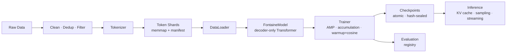

# Fontaine AI

**A modular, config-driven foundation-model platform that starts small
(single machine, 16 GB RAM) and scales toward large language models —
without rewriting the codebase.**

Fontaine AI is a decoder-only Transformer LLM (RoPE, grouped-query attention,
SwiGLU, RMSNorm) with a complete, professional toolchain: streaming data
pipeline, tokenizer subsystem, training engine, integrity-checked
checkpointing, registry-based evaluation, KV-cached inference, and a CLI.

> Honest scope: a 16 GB machine cannot train a GPT/Gemini-scale model. What
> Fontaine guarantees is that the *software* — configs, formats, interfaces —
> is already the software of the scaled-up system. See
> [docs/training/memory.md](docs/training/memory.md) for what is and isn't
> feasible.

## Architecture at a glance



Full diagrams and rationale: [docs/architecture/overview.md](docs/architecture/overview.md).

## Install

```bash
pip install -e .            # core: torch, numpy, pyyaml
pip install -e ".[bpe]"     # + byte-level BPE tokenizers (recommended)
pip install -e ".[dev]"     # + pytest, ruff
```

CPU-only PyTorch is enough to start:
`pip install torch --index-url https://download.pytorch.org/whl/cpu`

## Quickstart (your own data)

```bash
# 0. plan resources
fontaine model inspect --model-config configs/model/tiny.yaml

# 1. train a tokenizer on your corpus (char for dev, hf_bpe for real runs)
fontaine tokenizer train \
  --data-config configs/data/default.yaml --tokenizer-dir datasets/tokenizer \
  --set 'data.raw_paths=["datasets/raw"]' --set tokenizer.type=hf_bpe

# 2. validate + prepare shards + manifest
fontaine data validate --data-config configs/data/default.yaml \
  --set 'data.raw_paths=["datasets/raw"]'
fontaine data prepare \
  --data-config configs/data/default.yaml --tokenizer-dir datasets/tokenizer \
  --set 'data.raw_paths=["datasets/raw"]' --license "CC-BY-4.0"

# 3. train (auto-prepares data if no manifest exists yet)
fontaine train \
  --model-config configs/model/tiny.yaml \
  --training-config configs/training/local.yaml \
  --data-config configs/data/default.yaml \
  --tokenizer-dir datasets/tokenizer

# 4. generate (streaming)
fontaine generate --checkpoint experiments/<run>/checkpoints/latest \
  --tokenizer-dir datasets/tokenizer --prompt "Once upon a time" --interactive

# 5. evaluate / serve
fontaine evaluate --checkpoint experiments/<run>/checkpoints/best \
  --tokenizer-dir datasets/tokenizer
fontaine serve --checkpoint experiments/<run>/checkpoints/best \
  --tokenizer-dir datasets/tokenizer
```

Every command accepts `--config file.yaml` (repeatable) and
`--set section.key=value` overrides — no source edits, ever.

## Scaling path

| Stage | Params | Hardware |
| --- | --- | --- |
| Fontaine Tiny | 3–5 M | CPU / 16 GB RAM — **works today** |
| Fontaine Small | 40–60 M | modest GPU |
| Fontaine Medium | 130–160 M | 16 GB+ VRAM GPU |
| Fontaine Large → XL | 0.4–4 B | multi-GPU (DDP → FSDP) |
| Distributed Fontaine | 8 B+ | multi-node, TP/PP, sharded everything |

Sizes are YAML files, not code branches. The seams (`TrainingStrategy`,
`Tokenizer`, evaluator registry, `build_model`, checkpoint format v1) are the
migration path — see [docs/scaling/roadmap.md](docs/scaling/roadmap.md) and
[docs/development/roadmap.md](docs/development/roadmap.md).

## Repository

Source in `src/fontaine/`, configs in `configs/`, tests in `tests/` (92
tests, CPU-only, minutes), docs in `docs/`. Datasets, checkpoints,
experiments, and logs are artifacts — never committed. Full layout contract:
[docs/architecture/repository-layout.md](docs/architecture/repository-layout.md).

## License

MIT — see [LICENSE](LICENSE). This covers the *code*; your training data and
resulting model weights are governed by your data choices (see
[docs/development/security.md](docs/development/security.md)).
