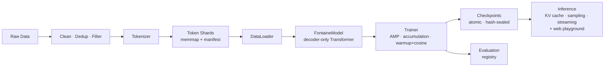

# Fontaine AI

**A modular, config-driven foundation-model platform that starts small
(single machine, 16 GB RAM) and scales toward large language models —
without rewriting the codebase.**

Fontaine AI is a decoder-only Transformer LLM (RoPE, grouped-query attention,
SwiGLU, RMSNorm) with a complete, professional toolchain: streaming data
pipeline, tokenizer subsystem, training engine, integrity-checked
checkpointing, registry-based evaluation, KV-cached inference, and a CLI.


## Architecture at a glance



Full diagrams and rationale: [docs/architecture/overview.md](docs/architecture/overview.md).

## Install

```bash
pip install -e .            # core: torch, numpy, pyyaml
pip install -e ".[bpe]"     # + byte-level BPE tokenizers (recommended)
pip install -e ".[dev]"     # + pytest, ruff
```

CPU-only PyTorch is enough to start:
`pip install torch --index-url https://download.pytorch.org/whl/cpu`

> Windows note: if the `fontaine` console script is not on your PATH after
> installing, run the CLI as `python -m fontaine.cli.main <command>` —
> identical behavior, same arguments.

## Quickstart (your own data)

```bash
# 0. plan resources
fontaine model inspect --model-config configs/model/tiny.yaml

# 1. train a tokenizer on your corpus (char for dev, hf_bpe for real runs)
fontaine tokenizer train \
  --data-config configs/data/default.yaml --tokenizer-dir datasets/tokenizer \
  --set 'data.raw_paths=["datasets/raw"]' --set tokenizer.type=hf_bpe

# 2. validate + prepare shards + manifest
fontaine data validate --data-config configs/data/default.yaml \
  --set 'data.raw_paths=["datasets/raw"]'
fontaine data prepare \
  --data-config configs/data/default.yaml --tokenizer-dir datasets/tokenizer \
  --set 'data.raw_paths=["datasets/raw"]' --license "CC-BY-4.0"

# 3. train — point at the manifest you just prepared
fontaine train \
  --model-config configs/model/tiny.yaml \
  --training-config configs/training/local.yaml \
  --data-config configs/data/default.yaml \
  --tokenizer-dir datasets/tokenizer \
  --set data.manifest_path=datasets/prepared/manifest.json

# 4. generate (streaming)
fontaine generate --checkpoint experiments/<run>/checkpoints \
  --tokenizer-dir datasets/tokenizer --interactive

# 5. evaluate / serve
fontaine evaluate --checkpoint experiments/<run>/checkpoints \
  --tokenizer-dir datasets/tokenizer
fontaine serve --checkpoint experiments/<run>/checkpoints \
  --tokenizer-dir datasets/tokenizer
```

Every command accepts `--config file.yaml` (repeatable) and
`--set section.key=value` overrides — no source edits, ever.

Two paths the loader accepts for `--checkpoint`: a checkpoints root such as
`experiments/<run>/checkpoints` (auto-resolves the newest step via
`latest.json`) or an exact step directory like
`experiments/<run>/checkpoints/step_00005000`.

> Gotcha: passing neither `data.manifest_path` nor `data.raw_paths` to
> `train` re-runs preparation from an empty path list and produces an empty
> dataset. Step 3 above is the safe form.

Verified end-to-end on the reference machine (CodeAlpaca-20k → hf_bpe
tokenizer → tiny model, 5,000 steps on CPU): final `val_loss` 2.14,
perplexity 8.5 — see `experiments/*/summary.json`.

## Docker: train and chat in the browser

The whole stack runs in one CPU container, and `fontaine serve` ships a
self-contained web playground at `GET /` (multi-turn memory, streaming,
sampling controls) alongside the JSON API.

```bash
cp .env.example .env          # pick the checkpoint to serve + host port
docker compose up -d web      # build + start → http://localhost:8321
docker compose run --rm train # one training run (writes to host folders)
```

Weights, tokenizer, and prepared data are bind-mounted, never baked in —
a new training run needs no rebuild. Full guide:
[docs/deployment/docker.md](docs/deployment/docker.md).

## Getting data in

Raw corpora: `.txt` (blank-line separated documents), `.jsonl` (one document
per line; `text` field or instruction/response pairs), `.json`, `.csv`.
Converters live in `tools/` — e.g. `tools/prepare_codealpaca.py` turns the
CodeAlpaca-20k download into Alpaca-template JSONL:

```bash
python tools/prepare_codealpaca.py \
  --input datasets/downloads/code_alpaca_20k.json \
  --output datasets/raw/codealpaca_20k.jsonl
```

A beginner-friendly, every-step guide (download → convert → prepare →
train → web playground) lives at [/docs/info.html]([docs/info.html](https://needyamin.github.io/YaMi/docs/info.html));
the Docker deep-dive at [docs/docker_info.html](https://needyamin.github.io/YaMi/docs/docker_info.html).

## Scaling path

| Stage | Params | Hardware |
| --- | --- | --- |
| Fontaine Tiny | 3–5 M | CPU / 16 GB RAM — **works today** |
| Fontaine Small | 40–60 M | modest GPU |
| Fontaine Medium | 130–160 M | 16 GB+ VRAM GPU |
| Fontaine Large → XL | 0.4–4 B | multi-GPU (DDP → FSDP) |
| Distributed Fontaine | 8 B+ | multi-node, TP/PP, sharded everything |

Sizes are YAML files, not code branches. The seams (`TrainingStrategy`,
`Tokenizer`, evaluator registry, `build_model`, checkpoint format v1) are the
migration path — see [docs/scaling/roadmap.md](docs/scaling/roadmap.md) and
[docs/development/roadmap.md](docs/development/roadmap.md).

## Repository

Source in `src/fontaine/`, configs in `configs/`, tests in `tests/` (92
tests, CPU-only, minutes), docs in `docs/`, dataset converter gadgets in
`tools/`. Datasets, checkpoints, experiments, and logs are artifacts — never
committed. Full layout contract:
[docs/architecture/repository-layout.md](docs/architecture/repository-layout.md).

## License

MIT — see [LICENSE](LICENSE). This covers the *code*; your training data and
resulting model weights are governed by your data choices (see
[docs/development/security.md](docs/development/security.md)).
