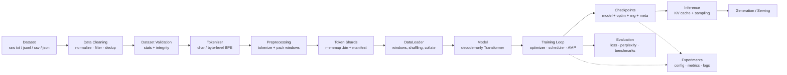
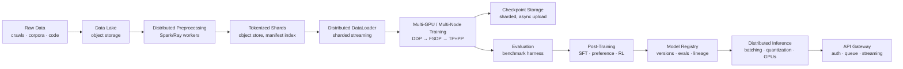

# Fontaine AI — Architecture Overview

## What Fontaine AI is

Fontaine AI is an independently designed, modular foundation-model platform.
Today it is a decoder-only Transformer language model with a complete
training and inference toolchain that runs on a single 16 GB machine. Its
defining property is that **the same codebase, configuration schema, and
artifact formats are designed to scale** toward GPT/Gemini-class systems:
multi-GPU, multi-node, multimodal, and post-training — by *replacing
implementations behind interfaces*, never by rewriting the project.

This is not a claim that a 16 GB machine can train a frontier model. It
cannot. It is a claim that the *software* will not have to be thrown away
when the hardware arrives.

## Design principles

1. Modular — each subsystem (model, data, tokenizer, training, checkpointing,
   evaluation, inference, distributed) is a package with a narrow interface.
2. Configurable — YAML configs + CLI overrides; no model/data/training
   constants in source code.
3. Reproducible — configs, git commit, tokenizer/dataset versions, seeds, and
   RNG states are captured in every experiment and checkpoint.
4. Testable — 92 tests, including an overfit-a-tiny-dataset sanity check and a
   full CLI end-to-end test.
5. Observable — experiment directories with `metrics.jsonl`, logs, summaries.
6. Memory-efficient — streaming data, memory-mapped shards, gradient
   accumulation/checkpointing, mixed precision.
7. Hardware-independent where practical — device resolution (`auto`),
   precision resolution per device, CPU-first development.
8. Dataset-independent — raw text/JSONL/CSV/JSON in; token shards out.
9. Model-size-independent — `FontaineModel` serves every size from Tiny to XL;
   sizes live in configs (`tiny.yaml` … `medium.yaml` …).
10. Backward-compatible — versioned config/checkpoint/manifest formats.
11. Easy to experiment with — one command per workflow stage.
12. Easy to scale — clean seams: `TrainingStrategy`, `Tokenizer`,
    `Evaluator` registry, `build_model` factory.
13. Avoid premature complexity — no distributed infra, no multimodal encoders,
    no serving cluster in the first release; only their interfaces.

## System architecture (current)

Every box is a package in `src/fontaine/`. Arrows are the only allowed
dependencies: data flows forward; metadata (manifests, checkpoints,
experiments) flows sideways into storage.

## Future architecture (scaled)

The migration is per-box: each future box replaces one current package
implementation while the arrows (interfaces) stay the same.

## Component inventory

| Component | Package | Stable interface | Current implementation | Future evolution |
| --- | --- | --- | --- | --- |
| Model | `fontaine.models` | `model(input_ids, targets, cache) -> ModelOutput` | `FontaineModel` (RoPE, GQA, SwiGLU) | MoE, Mamba, TP-sharded weights via `build_model` |
| Tokenizer | `fontaine.tokenizer` | `encode/decode/save/load/version` | char + HF byte-level BPE | SentencePiece, Unigram, multilingual |
| Data pipeline | `fontaine.data` | streaming iterators, `TokenShardDataset` | local filesystem shards | object storage, Spark/Ray workers, MinHash dedup |
| Training | `fontaine.training` | `Trainer.fit(resume=...)` | single-process AdamW loop | DDP/FSDP strategies, SFT/DPO trainers |
| Checkpointing | `fontaine.checkpointing` | `CheckpointManager.save/load/inspect` | atomic local dir + SHA-256 | sharded per-rank, async upload to object store |
| Evaluation | `fontaine.evaluation` | `Evaluator.run(model, ctx)` + registry | validation loss/perplexity | instruction/QA/code/reasoning benchmarks |
| Inference | `fontaine.inference` | `Generator.generate(stream=...)` | KV cache + sampling loop | continuous batching, quantization, GPU workers |
| Distributed | `fontaine.distributed` | `TrainingStrategy`, `ParallelContext` | single-device no-op | DDP (skeleton provided), FSDP, Megatron-style TP/PP |
| Config | `fontaine.config` | typed dataclasses + YAML + `--set` | dataclasses | unchanged; new fields only |

## What stays stable as Fontaine grows

- The **model forward signature** — trainer, evaluator, and inference all
  program against `input_ids, targets, cache → logits, loss`.
- The **config schema** — new sizes = new YAML files; new subsystems = new
  sections; existing fields never change meaning.
- The **checkpoint format** (versioned) — metadata + state; sharding extends
  rather than replaces it.
- The **dataset manifest** — provenance and integrity guarantees survive any
  storage backend.
- The **CLI verb set** — commands gain flags, not new shapes.
- The **experiment directory layout** — reproducibility contract.

## What will be replaced or expanded later

- Data pipeline internals (exact-dedup → MinHash/LSH; local FS → object store).
- Dedup/cleaning heuristics → quality classifiers, toxicity filtering.
- `TrainingStrategy` no-op → DDP → FSDP/DeepSpeed → tensor/pipeline parallel.
- Simple checkpoint dirs → sharded, asynchronous, resumable uploads.
- Validation-loss evaluation → full benchmark harness with generative tasks.
- Dev HTTP server → production serving (queue, batching, autoscaling).
- Byte-level BPE → possibly larger/multilingual vocabs (with model rebuild).

## Technology choices and rationale

| Dependency | Required | Why | Lock-in risk | Alternatives |
| --- | --- | --- | --- | --- |
| Python ≥3.10 | yes | ecosystem, readability | low | — |
| PyTorch | yes | tensors, autograd, SDPA, distributed | **high** (acceptable — it is the ecosystem standard) | JAX, MLX |
| NumPy | yes | memmap shards, array ops | low | — |
| PyYAML | yes | config files | low | TOML, JSON |
| `tokenizers` (HF) | optional `[bpe]` | fast byte-level BPE | medium — isolated to `hf_bpe.py` | SentencePiece, pure-Python BPE |
| `safetensors` | optional | safe weight export | low | torch.save |
| pytest | dev | testing | none | — |
| tensorboard / W&B | not yet | experiment tracking | none (seam: `ExperimentRun.log_metrics`) | mlflow, aim |

The first version deliberately has **three required runtime dependencies**.
