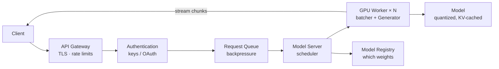

# Serving: From Dev Server to Production

## Today: local dev API

`fontaine serve` (stdlib-only) exposes two API families.

**Ollama-compatible** — lets off-the-shelf open-source chat UIs (Open WebUI
and any other Ollama client) connect to a Fontaine checkpoint directly, with
no model conversion. Streams are NDJSON (one JSON object per line), per the
Ollama API contract:

```
GET  /api/version   → {"version": "..."}
GET  /api/tags      → {"models": [{"name": "<run>", "details": {...}}]}
POST /api/show      → model metadata (template, parameter count)
POST /api/chat      {"messages": [{"role": "user", "content": "..."}],
                      "stream": true, "options": {"temperature": 0.7}}
→ {"message": {"role": "assistant", "content": "..."}, "done": false} × N
→ {"message": {"content": ""}, "done_reason": "stop", "done": true, ...}
```

Chat is stateless per request, like real Ollama: the client sends the full
history; the server renders it through the Alpaca-style template in
`fontaine.inference.chat_template` (matching the CodeAlpaca-style training
data). `options` maps onto the engine's sampling config (`num_predict` →
`max_new_tokens`, `repeat_penalty` → `repetition_penalty`, ...).

**Fontaine-native** — the original contract, kept for tooling and tests:

```
GET  /health        → {"status": "ok"}
POST /generate      {"prompt": "...", "stream": true, "temperature": 0.7}
→ data: {"delta": "..."} × N      (SSE stream)
→ {"text": "..."}                 (non-stream)
```

One `Generator` per process; requests serialize on the model lock. Good for
local tooling and integration tests, not for exposure beyond localhost.

## Production target architecture



## Evolution steps, in order

1. **Worker-per-process** — keep the stdlib API; run N worker processes with
   one `Generator` each (stateless requests, easiest scale-out, no new deps).
2. **Async gateway + queue** — FastAPI/uvicorn front end (or nginx) enqueuing
   to workers (Redis / SQSR / Celery); streaming stays SSE.
3. **Continuous batching** — a scheduler packs concurrent requests into one
   forward pass; requires batched `KVCache` (already batch-shaped) and
   per-request stop handling in the decode loop.
4. **Quantized GPU workers** — int8/int4 weights, paged KV; capacity ↑ 4–8×.
5. **Horizontal GPU fleet + autoscaling** — workers become stateless pods
   pulling from the queue; the registry decides which checkpoint each loads.
6. **Multi-region / routing** — gateway-level concerns, orthogonal to
   Fontaine internals.

## What Fontaine guarantees at every step

- The request/response contract (`prompt` + sampling params → deltas/text)
  is stable; clients don't change between tiers.
- The `Generator` interface is the *only* thing workers depend on — batching,
  quantization, and sharding are internal replacements.
- Every served response is traceable: the registry maps the deployment to a
  checkpoint, which maps to config + dataset + tokenizer versions.
