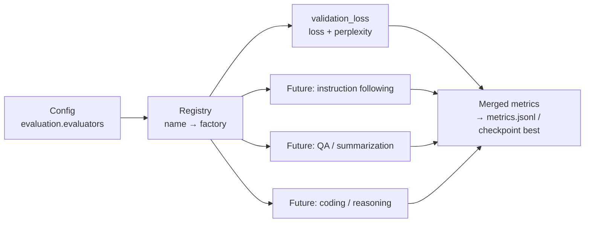

# Evaluation Architecture

Training loss is necessary but never sufficient. Fontaine's evaluation
subsystem is registry-based: benchmarks are *plugged in*, the training engine
and CLI never change.



## Mechanism

- `EvalContext` carries what evaluators may need: device, tokenizer, an eval
  DataLoader (from the manifest's `val` split), an optional `Generator`, and
  `max_batches`.
- `@register_evaluator("name")` registers a factory; the config lists
  `[{name, params}]`; `build_evaluator` instantiates.
- `Trainer.evaluate()` merges evaluator outputs (duplicate metric names are an
  error, keeping metrics unambiguous).

## Built-in: `validation_loss`

Token-weighted held-out cross-entropy + perplexity (`exp(loss)`, capped to
avoid overflow) over the validation split, `max_batches`-bounded for cheap
in-training evaluation.

## Adding a benchmark (no engine changes)

1. Subclass `GenerativeBenchmark` (or write any `run(model, context)` class).
2. Implement `iter_prompts()` and `score(prompt, completion)`.
3. `@register_evaluator("my_benchmark")` and list it in config:

```yaml
evaluation:
  split: val
  evaluators:
    - name: validation_loss
      params: {max_batches: 64}
    - name: my_benchmark
      params: {max_examples: 200}
```

Generative benchmarks run through the standard `Generator` (KV cache, shared
sampling config), so they inherit every future inference improvement.

## Planned benchmark families (future phases)

| Family | What it measures | Harness |
| --- | --- | --- |
| next-token / perplexity | base-model quality (done) | shard-based loss |
| instruction following | SFT usefulness | prompts + judge/heuristics |
| question answering | factual recall | exact-match / F1 |
| summarization | compression + fidelity | ROUGE + judge |
| coding | executable correctness | sandboxed test execution |
| reasoning | multi-step correctness | curated sets, self-consistency |
| internal/regression | project-specific drift | same registry, private configs |

## Standalone use

```bash
fontaine evaluate --checkpoint <ckpt> --tokenizer-dir datasets/tokenizer \
  --set data.manifest_path="datasets/prepared/manifest.json"
```
