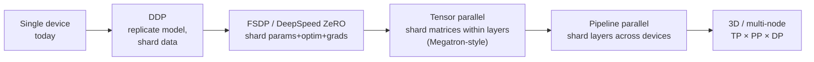

# Scaling Roadmap

The executable profile ladder, from a few million parameters through a
trillion-parameter mixture-of-experts configuration, is
[yami-super.md](yami-super.md). Counts there come from
`model estimate-params`. A large profile is an architecture you can plan,
not a trained model.

## Size ladder

Architectural targets — not promises that any size trains on the initial
16 GB machine.

| Stage | Params (≈) | hidden × layers | Context | Train state before activations | Hardware tier |
| --- | --- | --- | --- | --- | --- |
| Fontaine Tiny | ~5.2 M dense | 256 × 4 | 256 | ~80 MB | CPU / any GPU — **today** |
| Fontaine Small | ~28 M dense | 512 × 8 | 512 | ~0.4 GB | modest GPU |
| Fontaine Medium | ~82 M dense | 768 × 12 | 1024 | ~1.2 GB | free GPU (Kaggle T4) |
| Coding Low | 5.7 M active / 22 M total | 256 × 6, 8 experts top-1 | 512 | ~0.3 GB | laptop CPU, 16 GB RAM |
| Coding Mid | 39 M active / 114 M total | 512 × 8, 8 experts top-2 | 1024 | ~1.8 GB | desktop CPU or free GPU |
| Coding High | 129 M active / 384 M total | 768 × 12, 8 experts top-2 | 2048 | ~6 GB | GPU to train; workstation CPU to run |
| Yami Nano | 25 M dense | 384 × 8 | 2048 | ~0.4 GB | any 4-core CPU, 4-8 GB RAM |
| Yami Small | 115 M dense | 768 × 12 | 4096 | ~1.8 GB | laptop CPU, 8-16 GB RAM |
| Yami Base | 323 M dense | 1024 × 24 | 4096 | ~5.2 GB | 8+ core desktop CPU, 16-32 GB RAM |
| Yami Large | 1.06 B dense | 2048 × 22 | 8192 | ~17 GB | 12+ core workstation CPU, 32 GB+ RAM |
| Fontaine Large | 400–700 M | 1024 × 24 | 2048 | 40–80 GB | single A100/H100 class |
| Fontaine XL | 1–4 B | 2048 × 24–32 | 4096 | multi-GPU | 4–8 GPUs, FSDP/ZeRO |
| Distributed Fontaine | 8–70 B+ | 4096–8192 × 32–80 | 8k–128k | cluster | multi-node FSDP + TP/PP |

Dense rows assume an 8k vocabulary. Coding rows are `moe_decoder`: total
parameters count every expert (that is what AdamW stores); active parameters
are what one token multiplies. `fontaine model inspect` prints both.

Context lengths assume RoPE theta scaling plus training-data length mix.

## Yami CPU ladder

The Yami rows (`configs/model/yami_*.yaml`) are counted at a 32k vocabulary
and share one recipe: GQA, SwiGLU, RMSNorm, RoPE with theta 500000, QK-norm,
and tied embeddings. Base and Large also use sliding-window attention, with
three 1024-token local layers for each global layer. The "hardware tier"
column is where each size **runs**. Training Base and Large still wants a
GPU (the column before it is AdamW state alone).

Serving memory with int8 weights and a full-context KV cache, from
`fontaine model inspect`:

| Tier | fp32 weights | int8 weights | KV cache (full window) |
| --- | --- | --- | --- |
| Nano | 96 MiB | 72 MiB | 16 MiB |
| Small | 438 MiB | 206 MiB | 96 MiB |
| Base | 1.20 GiB | 436 MiB | 192 MiB |
| Large | 3.95 GiB | 1.24 GiB | 704 MiB |

`fontaine model recommend` reads the core count and RAM and prints the
largest tier that fits. On an AVX2 laptop CPU, int8 decodes at roughly fp32
speed for Small and about 20% faster for Base; the main gain is memory. CPUs
with VNNI or AMX gain more.

## Scaling dimensions and what they hit

| Dimension | RAM (host) | VRAM (GPU) | Disk | Training time | Inference latency |
| --- | --- | --- | --- | --- | --- |
| Parameters | checkpoints, data prep | weights+grads+optim+acts | checkpoints (∝) | ∝ params | ∝ params (weights touched per token) |
| Context length | — | attention + KV cache (GQA dents it) | — | ∝ ~seq² attention | KV cache size ∝ seq |
| Vocabulary | shard dtype | embedding + head | — | mildly | logits + KV head dim |
| Data size | pipeline is streaming | — | shards ∝ data | ∝ tokens (Chinchilla ≈ 20 tokens/param) | — |
| Compute (steps) | — | — | more checkpoints | ∝ steps | — |
| Batch size | — | activations | — | fewer, larger steps | — |
| Multi-GPU | — | per-GPU share ↓ | — | ↓ (communication overhead) | ↓ with sharding |
| Multi-node | — | — | object storage | ↓ (network-bound) | serving capacity ↑ |

Chinchilla-style guidance: at fixed compute, parameters and training tokens
should scale together (~20 tokens/param). Data is usually the cheaper
resource — scale the model only when the data pipeline feeds it.

## Parallelism path (as models outgrow single GPUs)

```mermaid
flowchart LR
    S1[Single device<br/>today] --> S2[DDP<br/>replicate model,<br/>shard data]
    S2 --> S3[FSDP / DeepSpeed ZeRO<br/>shard params+optim+grads]
    S3 --> S4["Tensor parallel<br/>shard matrices within layers<br/>(Megatron-style)"]
    S4 --> S5[Pipeline parallel<br/>shard layers across devices]
    S5 --> S6[3D / multi-node<br/>TP × PP × DP]
```

| Strategy | Use when | Cost | Fontaine seam |
| --- | --- | --- | --- |
| Gradient accumulation | OOM on batch | none | implemented |
| Gradient checkpointing | OOM on activations | ~30% recompute | implemented |
| DDP | model fits one GPU | gradient all-reduce | `DistributedDataParallelStrategy`, or `data_parallel_size` |
| FSDP/ZeRO | model > one GPU | comms + prefetching | `training.sharding: fsdp` or `optimizer` |
| Tensor parallel | layers > one GPU | all-gather / all-reduce per layer | `tensor_parallel_size` |
| Pipeline parallel | depth-bound clusters | activation and gradient send | `pipeline_parallel_size` |
| Distributed checkpoints | tensor, pipeline, or expert parallel | one shard per rank | `model_rank{r}.pt` when those sizes are above 1 |
| Distributed data loading | many workers | — | `DistributedSampler` already wired |

## What changes at each tier — and what doesn't

- **Configs** grow new YAML files; the schema never mutates meaning.
- **`TrainingStrategy`** gains implementations; the `Trainer` loop stands.
- **Checkpointing** shards per rank behind the same manager API.
- **Data** moves to object storage + distributed preprocessing behind the same
  manifest contract.
- **Inference** moves to batched GPU workers behind the same `Generator`
  contract.

Nothing above requires *rewriting* Fontaine — each is an implementation
behind an interface that already exists.
