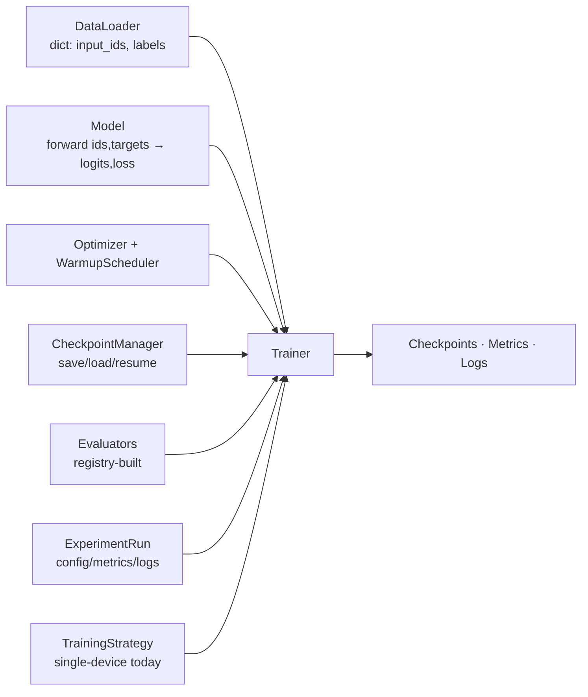

# Training Process

## Component separation

The trainer contains **no dataset-specific or model-specific logic**. It
composes collaborators behind explicit interfaces:

| Collaborator | Interface consumed by Trainer |
| --- | --- |
| DataLoader | yields `{"input_ids": LongTensor[B,T], "labels": LongTensor[B,T]}`; `-100` labels ignored |
| Model | `model(input_ids, targets=...) -> ModelOutput(logits, loss)` |
| Optimizer | `build_optimizer` — AdamW, decay on 2D+ weights only |
| Scheduler | `WarmupScheduler` — linear warmup → cosine to `min_ratio·lr` (or constant); state = one int |
| CheckpointManager | `save(step, ...)` / `load("latest"|"best"|path, ...)` |
| Evaluators | `evaluator.run(model, EvalContext) -> dict[str, float]` from the registry |
| ExperimentRun | `log_metrics(metrics, step)`, artifact dirs |
| TrainingStrategy | `wrap_model`, `sync_metrics`, `wait_for_everyone` (no-op today) |

## What one optimizer step does

1. `gradient_accumulation_steps` micro-batches: forward under autocast,
   `loss / accum`, backward (scaled when fp16).
2. Unscale (if scaler) → global-norm clip (`max_grad_norm`) → optimizer step
   → scheduler step.
3. Every `log_interval` steps: loss + LR to console and `metrics.jsonl`.
4. Every `eval_interval` steps: run evaluators → metrics logged; best-tracking
   and optional early stopping (`early_stopping_patience`).
5. Every `checkpoint_interval` steps: full checkpoint (model + optimizer +
   scheduler + scaler + RNG + metadata); pruning keeps `keep_last_n` plus best.

## Configured by `TrainingConfig`

batch size, gradient accumulation, LR/min-LR ratio, scheduler, warmup,
weight decay, betas, grad clipping, precision (`auto`/fp32/bf16/fp16),
gradient checkpointing, device (`auto`/cpu/cuda/mps), intervals, seed,
deterministic mode, early stopping, run name, experiments dir.

Precision `auto`: CUDA → bf16 (no scaler) if supported else fp16 + GradScaler;
MPS → fp16; CPU → fp32.

## Resume

`fontaine train --resume <checkpoints_dir>` restores model, optimizer,
scheduler, scaler, RNG states, and the step counter; the experiment directory
is re-attached so `metrics.jsonl` continues one history. The seeded DataLoader
generator resumes the same data order.

## Post-training future

The same class structure hosts SFT (instruction dataset + masked labels) and
new trainers (DPO/RL) subclass or compose `Trainer` — see
`docs/research/post-training.md`.
